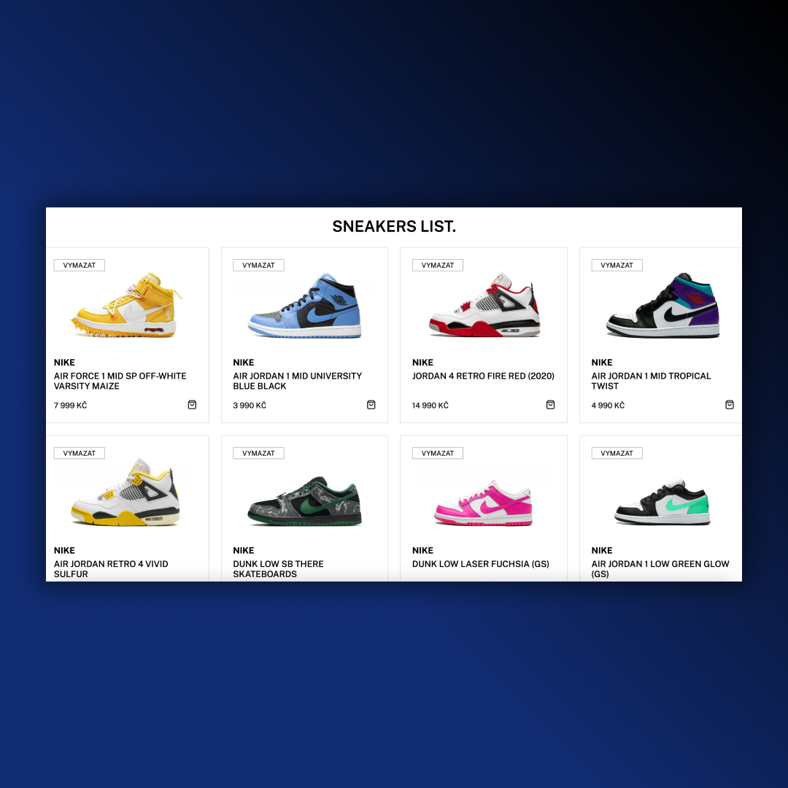
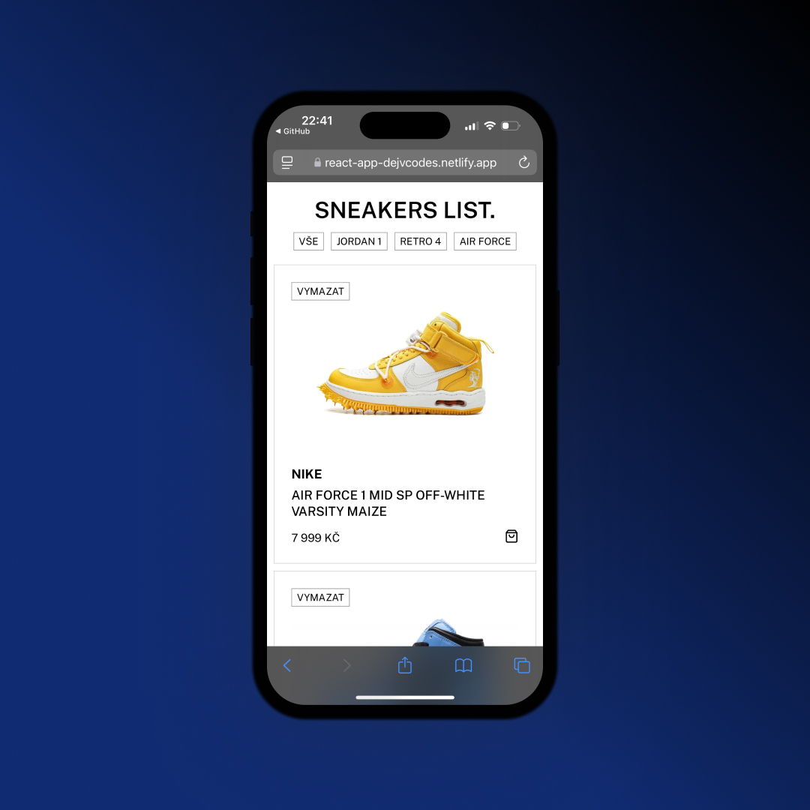

## React App
• Working with React  
• map, propTypes, props, useState  
• Responsive Design 

## Screenshots 📱
 

## 💻 Tech Stack

## 🌐 Link
<a href="https://react-app-dejvcodes.netlify.app/">React App</a>

## License🔐
[MIT License](LICENSE) 