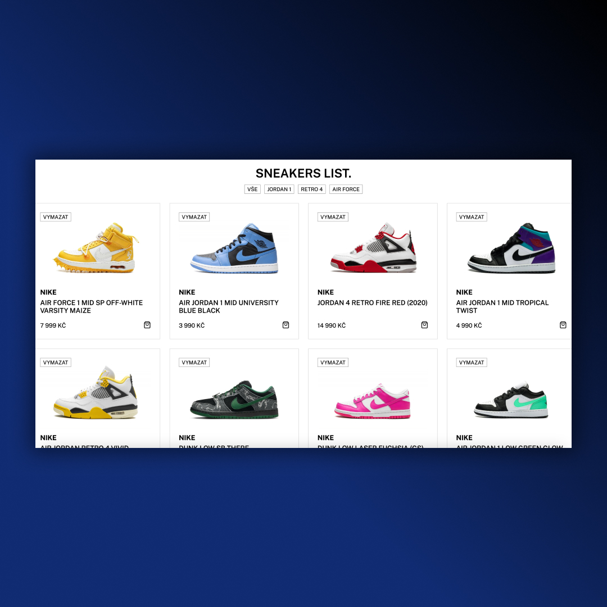

## React App
• Working with React  
• Map, PropTypes, Props  
• Responsive Design 

## Screenshots 📱
 

## 💻 Tech Stack

## 🌐 Link
<a href="https://nexa-yonder.netlify.app/">React App</a>

## License🔐
[MIT License](LICENSE) 